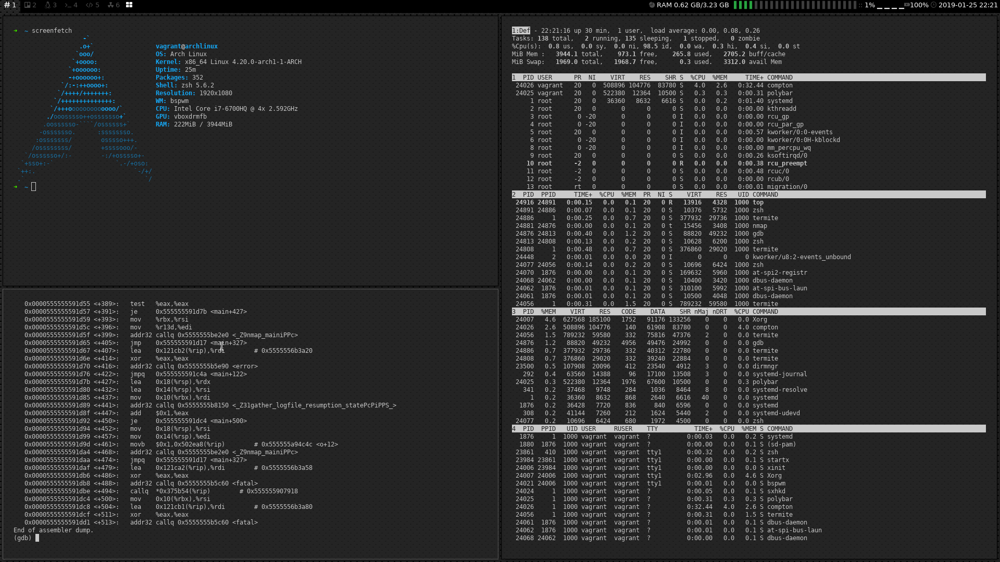

# Hackistan
**Arch linux, bspwm, yay, BlackArch Repos**

This uses vagrant, but everything should work on a clean install of Arch



******

## Getting Started

### Vagrant

#### Single Machine

```
vagrant up
vagrant ssh
```

#### Multi Machine

```
cp example.boxes.yaml boxes.yaml
vim boxes.yaml # customize if you want
vagrant up op1

vagrant up op2

# done with op2
vagrant destroy op2

```

sometimes its nice not to have to be in the vagrant folder. you can add a VM's ssh config to your config.
```
vagrant ssh-config >> ~/.ssh/config
```

Then you should be able to run the following from anywhere.
```
ssh op1
```

******


### Bare metal

- create a user, with sudo permissions
- clone the repo

```
cd hackistan
provisioners/install.sh
```
